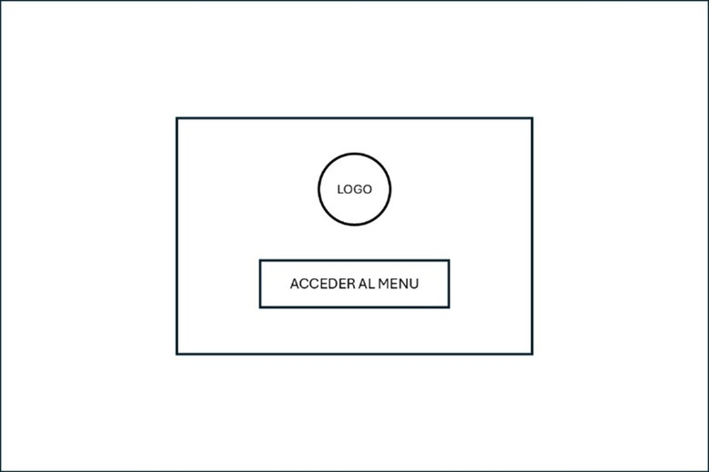
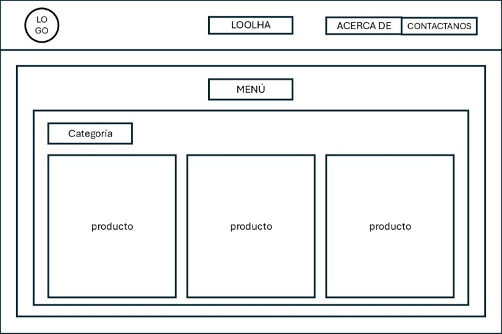
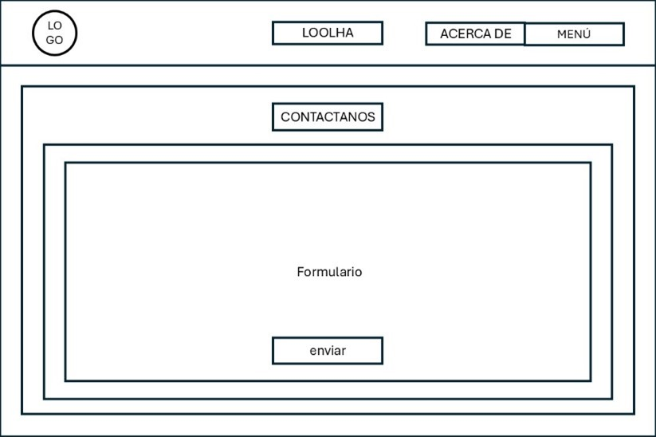

<h1 align="center">SRS - Especificación de Requisitos de Software</h1>

- ## Introducción
    - ### Nombre del proyecto
        ***Loolha virtual***
    - ### Objetivo general
        El objetivo del proyecto Loolha virtual, es desarrollar un sitio web que permita virtualizar el menú del restaurante Loolha sustituyendo los menús tradicionales impresos por una versión digital accesible principalmente desde dispositivos móviles.

        Con el fin de facilitar la innovación del menú, los administradores podrán agregar, consultar, actualizar y eliminar sus platillos y bebidas mediante dispositivos de cómputo, mostrando los platillos y bebidas con una imagen, descripción y precio, además de poder destacar productos especiales mediante un diseño visual atractivo, facilitando la elección de los platillos por parte de los consumidores mediante sus dispositivos móviles.

    - ### Visión general
        Loolha Virtual busca convertirse en una herramienta digital moderna e intuitiva que sustituya los menús físicos del restaurante Loolha, ofreciendo a los clientes una experiencia visual atractiva, rápida y accesible desde cualquier dispositivo móvil.

        Su propósito es innovar la forma en que los comensales consultan la oferta gastronómica, facilitando al mismo tiempo la gestión del menú por parte de los administradores mediante una interfaz web sencilla, eficiente y actualizable en tiempo real.

    - ### Alcance del sistema
        El proyecto Loolha Virtual está dirigido a los administradores y clientes del restaurante Loolha, con el propósito de modernizar la forma en que se presenta el menú y facilitar su gestión mediante una plataforma digital accesible desde cualquier dispositivo con conexión a internet.

        Los administradores del restaurante podrán gestionar fácilmente los platillos y bebidas desde una computadora o laptop, sin depender de diseños impresos.

        Los clientes y comensales del restaurante, quienes podrán visualizar el menú digital desde sus teléfonos móviles, tablets o computadoras, explorando platillos y bebidas con imágenes, descripciones y precios actualizados.

- ## Glosario de términos
    - | Termino  | Definición  |
        |------------|------------|
        | ***Menú*** | Lista digital de los platillos y bebidas que el restaurante ofrece, ordenados por categorías. Incluye el nombre, descripción, imagen, precio y categoría del producto.|
        | ***Categoría*** | Clasificación que agrupa los diferentes platillos y bebidas en varios conjuntos para mantener el orden en el menú.  |
        | ***Platillo*** | Preparación culinaria ofrecida en el menú del restaurante, se divide en entrada, plato fuerte y postre. |
        | ***Entrada*** | Primer platillo ligero que se sirve antes del plato fuerte. Ejemplo: ensaladas o botanas. |
        | ***Plato fuerte*** | Platillo principal del menú, generalmente más elaborado y sustancioso. Ejemplo: pastas. |
        | ***Postre*** | Platillo dulce que se sirve al finalizar la comida. Ejemplo: pasteles, helados, flanes. |
        | ***Bebida*** | Líquido que acompaña los alimentos. Puede ser natural, cafés y malteadas. |
        | ***Especial del día*** | Platillo o bebida destacada temporalmente por el restaurante, ya sea por promoción o temporada. |

---

- ## Descripción del sistema
    - ### Actores principales (administradores, usuarios).
        - #### Administradores
            Son el personal del restaurante encargada de gestionar la información del menú, actualizar precios, agregar o eliminar platillos, y mantener la información actualizada en la página web.
        - #### Consumidores (usuarios)
            Son los clientes del restaurante y a su vez lo usuarios que visitarán el sitio web del restaurante para consultar el menú, conocer la información del lugar o contactarlo mediante el formulario.

    - ### Funcionamiento del sistema.
        El sistema funcionará como una aplicación web compuesta por dos apartados principales:
        - #### Administración:
            Accesible desde computadoras, permitirá iniciar sesión y realizar operaciones CRUD (crear, leer, actualizar, eliminar) sobre los platillos y bebidas del menú.

        - #### Usuarios
            Accesible desde cualquier dispositivo, mostrará el menú actualizado con sus categorías, además de ofrecer acceso a las secciones “Acerca de” y “Contáctanos”.

            Los cambios realizados por el administrador se reflejarán en el contenido visual del sitio una vez que se actualicen los archivos del servidor.
    - ### Restricciones. 
        - En dispositivos móviles no se podrá acceder al panel de administración del menú del restaurante, solo se podrá acceder al menú, acerca de y contáctanos.

        - Los cambios realizados desde un equipo de cómputo no se reflejarán automáticamente en otros dispositivos, ya que la página no está alojada en red.
        - Para visualizar las actualizaciones en dispositivos móviles, se deberá guardar la versión más reciente del sitio desde un equipo de cómputo.
        - El sistema se limita a la gestión y visualización del menú digital del restaurante Loolha, no incluye la toma de pedidos, pagos en línea ni la integración con sistemas externos.
---
- ## Requisitos funcionales
    - ### RF 1 - Inicio de sesión del administrador
        El sistema deberá permitir que el administrador inicie sesión ingresando un nombre de usuario y una contraseña válidos. El sistema verificará los datos ingresados con los datos almacenados en la base de datos y, en caso de coincidencia, deberá otorgar acceso al panel de administración. Si los datos son incorrectos, el sistema mostrará un mensaje de error y no permitirá el acceso.
    - ### RF 2 - Registro de nuevos platillos o bebidas
        El sistema deberá permitir que el administrador agregue nuevos productos al menú digital mediante un formulario que incluya los campos: nombre del producto, descripción, precio, imagen y categoría. El sistema deberá validar que todos los campos obligatorios estén completos antes de permitir su registro y guardara la información en la base de datos.
    - ### RF 3 - Consulta de productos registrados
        El sistema deberá permitir que el administrador consulte la lista completa de los productos registrados en el menú, mostrando para cada uno su nombre, descripción, precio, imagen y categoría. Esta consulta deberá estar disponible únicamente dentro del panel de administración y deberá mostrar la información de manera ordenada y legible.
    - ### RF 4 - Actualización de productos existentes
        El sistema deberá permitir que el administrador seleccione un producto previamente registrado y modifique cualquiera de sus datos (nombre, descripción, imagen, precio o categoría). Una vez confirmada la actualización, el sistema deberá guardar los cambios y reflejarlos en la base de datos.
    - ### RF 5 - Eliminación de productos del menú
        El sistema deberá permitir que el administrador elimine un producto existente del menú. Antes de eliminarlo, el sistema deberá solicitar confirmación y, una vez aprobada, eliminarlo definitivamente de la base de datos.
    - ### RF 6 - Cierre de sesión del administrador
        El sistema deberá permitir que el administrador cierre su sesión desde el panel de administración. Una vez cerrada, el sistema automáticamente ira a la página principal del sitio web.
    - ### RF 7 - Consulta del menú por parte del usuario
        El sistema deberá permitir que cualquier usuario visualice el menú del restaurante sin necesidad de autenticación. El menú deberá mostrar cada producto con su nombre, precio, imagen, descripción y su categoría correspondiente. La presentación deberá ser organizada y accesible desde dispositivos móviles y computadoras.
    - ### RF 8 - Consulta de información (“Acerca de”)
        El sistema deberá permitir que los usuarios accedan a una sección informativa denominada “Acerca de”, donde se mostrará información general del restaurante (por ejemplo: misión, visión o descripción institucional). La información deberá ser visible sin necesidad de autenticación.
    - ### RF 9 - Envío de mensajes de contacto
        El sistema deberá permitir que los usuarios envíen un mensaje al restaurante mediante un formulario que recoja el nombre del usuario, su correo electrónico y el contenido del mensaje. Una vez enviado, el sistema deberá mostrar un mensaje de confirmación e indicar que el formulario ha sido enviado correctamente.

- ## Requisitos no funcionales
    - ### RNF 1 - Usabilidad de la interfaz
        La interfaz del sistema deberá ser intuitiva y fácil de usar tanto para administradores como para los usuarios. Los elementos de navegación deberán estar claramente identificados y su comprensión no deberá requerir conocimientos técnicos ni avanzados.
    - ### RNF 2 - Rendimiento de carga
        El sistema deberá cargar la información del menú en un tiempo máximo de 3 segundos. La carga deberá ejecutarse sin bloqueos ni retrasos perceptibles para el usuario.
    - ### RNF 3 - Seguridad visual en el inicio de sesión
        Durante el proceso de inicio de sesión, el campo de contraseña deberá ocultar los caracteres ingresados mostrando únicamente el símbolo “*”, con el objetivo de proteger la información del usuario administrador frente a observadores externos.
    - ### RNF 4 - Cambios del contenido
        El sistema deberá permitir agregar, actualizar o eliminar productos del menú mediante la interfaz de administración sin necesidad de modificar directamente el código fuente. Los cambios deberán almacenarse y recuperarse desde la base de datos.
    - ### RNF 5 - Compatibilidad con navegadores
        El sitio web deberá ser completamente funcional y visualmente estable en los navegadores Google Chrome, Microsoft Edge, Mozilla Firefox, Opera y Brave, tanto para equipos de cómputo y dispositivos móviles.
    - ### RNF 6 - Diseño responsivo
        El sitio web deberá adaptarse correctamente a diferentes resoluciones y tamaños de pantalla, incluyendo equipos de cómputo, laptops, tablets y dispositivos móviles. 

---

<h2 align="center">Clasificación de los requisitos funcionales por prioridad (alta, media, baja).</h2>

<table style="margin-left: auto; margin-right: auto;">
  <tr>
    <th style="width: 50px;">RF</th>
    <th>Requisito</th>
    <th style="width: 100px; text-align: center;">Prioridad</th>
    <th>Justificación</th>
  </tr>
  <tr>
    <td>1</td>
    <td>Inicio de sesión del administrador</td>
    <td style="text-align: center;">Alta</td>
    <td>Es fundamental para que el administrador pueda acceder al sistema y gestionar el menú.</td>
  </tr>
  <tr>
    <td>2</td>
    <td>Registro de nuevos platillos o bebidas</td>
    <td style="text-align: center;">Alta</td>
    <td>Es una función central del sistema de administración de menú.</td>
  </tr>
  <tr>
    <td>3</td>
    <td>Consulta de productos registrados</td>
    <td style="text-align: center;">Media</td>
    <td>Es importante para gestión, pero no crítico para la operación inmediata; se puede visualizar, pero no es imprescindible.</td>
  </tr>
  <tr>
    <td>4</td>
    <td>Actualización de productos existentes</td>
    <td style="text-align: center;">Alta</td>
    <td>Necesario para mantener el menú actualizado y correcto.</td>
  </tr>
  <tr>
    <td>5</td>
    <td>Eliminación de productos del menú</td>
    <td style="text-align: center;">Alta</td>
    <td>Es esencial para retirar productos que ya no están disponibles.</td>
  </tr>
  <tr>
    <td>6</td>
    <td>Cierre de sesión del administrador</td>
    <td style="text-align: center;">Media</td>
    <td>Importante por seguridad, pero el sistema puede funcionar, aunque no se cierre sesión correctamente.</td>
  </tr>
  <tr>
    <td>7</td>
    <td>Consulta del menú por parte del usuario</td>
    <td style="text-align: center;">Alta</td>
    <td>Es la función principal del sistema para los usuarios; si no funciona, el sistema pierde su propósito.</td>
  </tr>
  <tr>
    <td>8</td>
    <td>Consulta de información (“Acerca de”)</td>
    <td style="text-align: center;">Baja</td>
    <td>Información adicional que no afecta la operación principal del sistema.</td>
  </tr>
  <tr>
    <td>9</td>
    <td>Envío de mensajes de contacto</td>
    <td style="text-align: center;">Baja</td>
    <td>Función útil para comunicación, pero no indispensable para la operación del menú.</td>
  </tr>

</table>

---

- ## Casos de uso de forma textual
- ### Administrador 
    - #### Caso de uso 1: Iniciar sesión como administrador
        - ##### Propósito: Permitir que el administrador acceda al panel de control del sistema para gestionar el contenido del menú.
            El administrador al acceder a la pagina principal del sitio web, podrá acceder al registro de administración mediante un botón, el sistema mostrará el formulario de inicio de sesión y podrá ingresar su nombre de administrador junto con su contraseña.
            El sistema verificara si los datos son correctos para posteriormente acceder al panel de administración, de lo contrario el sistema mostrara un mensaje de error e invitara al administrador a intentar de nuevo.
    - #### Caso de uso 2: Agregar platillo o bebida al menú
        - ##### Propósito: Permitir que el administrador registre nuevos productos en el menú digital del restaurante.
            El administrador, desde el panel de administración, podrá acceder a la sección “Agregar”. El sistema mostrará un formulario donde se podrá ingresar el nombre del platillo o bebida, descripción, precio, imagen y categoría correspondiente.
            Una vez completado el formulario, el administrador podrá guardar la información; el sistema verificará que todos los campos obligatorios estén llenos y que los datos sean válidos.
            Si todo es correcto, el nuevo producto se añadirá al menú y se mostrará un mensaje de éxito. 
    - #### Caso de uso 3: Consultar platillos y bebidas del menú
        - ##### Propósito: Permitir que el administrador visualice la información completa de los productos registrados en el menú digital.
            El administrador, una vez que haya iniciado sesión en el panel de administración, podrá acceder a la sección “Consultar”.
            El sistema mostrará la lista de todos los platillos y bebidas disponibles, organizados por categorías. Cada producto incluirá su nombre, descripción, precio, imagen y categoría asignada. El administrador podrá consultar la información de cada producto sin necesidad de modificarla, 
    - #### Caso de uso 4: Actualizar platillo o bebida existente
        - ##### Propósito: Permitir que el administrador modifique la información de un producto previamente agregado en el menú.
            El administrador, desde el panel de administración, podrá acceder a la sección “Actualizar” y podrá visualizar la lista completa de los platillos y bebidas registrados. Al seleccionar un producto, el sistema permitirá editar los campos con su información actual.
            El administrador podrá modificar los datos necesarios, como nombre, descripción, imagen, precio o categoría.
            Una vez realizados los cambios, podrá guardar la actualización y se podrá visualizar los cambios en el menú. 
    - #### Caso de uso 5: Eliminar platillo o bebida del menú
        - ##### Propósito: Permitir que el administrador elimine del menú los productos que ya no estén disponibles.
            El administrador, dentro del panel de administración, podrá acceder a la sección “Eliminar” y podrá acceder a la lista de todos los platillos y bebidas.
            Al seleccionar un producto, el sistema mostrará la opción para eliminarlo.
            Una vez eliminado el producto se podrá visualizar los cambios en el menú.

    - #### Caso de uso 6: Cerrar sesión
        - ##### Propósito: Permitir que el administrador finalice su sesión de forma segura y regrese a la página principal.
            Cuando el administrador haya terminado de realizar las gestiones necesarias dentro del panel de administración, podrá hacer clic en el botón “Cerrar sesión”.
            El sistema cerrará la sesión actual y redirigirá al usuario a la página principal del sitio web.
- ### Usuarios 
    - #### Caso de uso 1: Acceder al menú del restaurante
        - ##### Propósito: Permitir que el usuario consulte los platillos y bebidas que el restaurante ofrece en su menú digital.
            El usuario, al entrar a la página principal del sitio web, podrá presionar el botón de acceso al menú.
            El sistema mostrará la lista completa de platillos y bebidas disponibles, organizados por categorías (entradas, platos fuertes, postres y bebidas).
            Cada producto se mostrará con su nombre, descripción, precio e imagen ilustrativa.
            El usuario podrá desplazarse libremente por el menú para conocer las diferentes opciones.
            En caso de que el sistema no encuentre productos disponibles, se mostrará un mensaje indicando que el menú está temporalmente vacío.
    - #### Caso de uso 2: Consultar información “Acerca de”
        - ##### Propósito: Permitir que el usuario conozca la información general del restaurante.
            Desde el menú principal, el usuario podrá acceder a la sección “Acerca de” para conocer detalles del restaurante, como su misión y visión.
            El sistema mostrará la información de forma estática y accesible en cualquier dispositivo.
            El usuario podrá leer libremente la información y regresar al menú en cualquier momento mediante un botón de retorno.
    - #### Caso de uso 3: Enviar mensaje de contacto 
        - ##### Propósito: Permitir que el usuario envíe un mensaje al restaurante desde un dispositivo móvil de forma rápida.
            El usuario accederá a la sección “Contáctanos” desde el menú mediante un botón.
            El sistema mostrará el formulario de contacto con los mismos campos (nombre, correo y mensaje).
            Al presionar el botón “Enviar”, el sistema mostrará un mensaje emergente (“Mensaje enviado correctamente”) y devolverá al usuario al menú.

---

- ## Metodología de desarrollo
    - ### Cascada y desarrollo incremental 
        Para el desarrollo del proyecto se seleccionó el modelo en cascada durante las primeras etapas (Requisitos y Diseño), y un enfoque incremental con tres incrementos durante la etapa de construcción, pruebas y mantenimiento.

        - Primer incremento: Se enfocará en las páginas de administración (CRUD).

        - Segundo incremento: Se enfocará en el menú del restaurante.
        - Tercer incremento: Se enfocará en la página de acerca de y contáctanos.

---

- ## Roles de los integrantes
    - ### Requisitos (Analista de requisitos)
        Luis Fernando Pool Tamay
    - ### Diseño (Diseñador de software)
        Edgar Abisai Chimal Cupul 
    - ### Construcción (Developer)
        Angel Julian Tec Medina
    - ### Pruebas (Tester - QA)
        Jimmy Alexander Febles Ciau
    - ### Mantenimiento (Developer)
        Angel Julian Tec Medina
    
    *(Todos los integrantes estarán involucrados en cada área, pero esos serán su rol principal)*

---

- ## Prototipo de la página

    - ### Inicio
        

    - ### Login de administración
        

    - ### Panel de administración
        

    - ### Crear platillo
        

    - ### Leer platillos
        

    - ### Actualizar platillos
        

    - ### Eliminar platillos
        

    - ### Menú
        

    - ### Acerca de
        

    - ### Contáctanos
        

